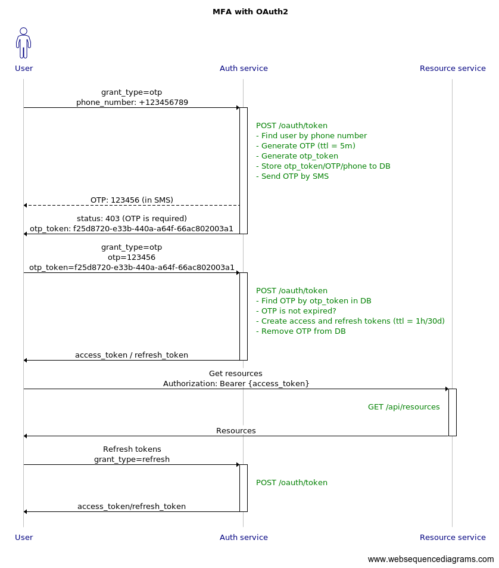

# OAuth2 with multi-factor authentication

A variant of implementation with Spring Boot and [Spring Security OAuth Boot 2 Autoconfig](https://docs.spring.io/spring-security-oauth2-boot/docs/2.2.x/reference/htmlsingle/)

### Flow diagram

[Sample requests](api-demo.http)